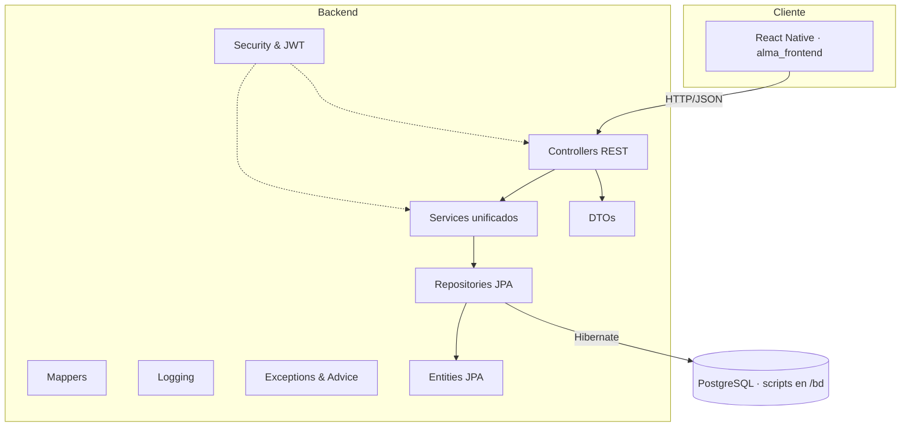

# Fase 1 · Informe de arquitectura

## 1. Visión general del repositorio
- **alma_backend/**: API REST en Spring Boot 3.5 con autenticación JWT, estructura clásica controller → service → repository, DTOs y configuración de seguridad/Jackson; ahora incorpora capas dedicadas de mapper, logging y excepciones para uniformar la respuesta del backend.
- **alma_frontend/**: Aplicación móvil React Native (Expo) con estructura modular (navigation, screens, services, hooks, theme).
- **bd/**: Scripts SQL versionados (estilo Flyway) que reflejan la evolución del modelo de datos PostgreSQL.
- **README.md / LICENSE**: documentación base del proyecto.

## 2. Diagrama lógico por capas

## 3. Backend · descripción de paquetes principales (`com.alma.alma_backend`)
| Paquete | Responsabilidad | Clases destacadas |
|---------|-----------------|-------------------|
| `controller` | Endpoints REST organizados por dominio (autenticación, pacientes, citas, recursos, foros, IA, etc.). | `AuthenticationController`, `PacienteController`, `ChatPacientesController`, `RecursoController`, `MetaDiariaController`, `IAController`, `PruebaController` (debug/test).
| `service` | Interfaces + implementaciones que concentran la lógica de negocio (gestión de usuarios, citas, foros, progreso del duelo, informes emocionales, IA, recursos multimedia, auditoría). | `AuthServiceImpl`, `UsuarioServiceImpl`, `ProgresoDueloServiceImpl`, `IAServiceImpl`, `RecursoServiceImpl`, `AsignacionProfesionalPacienteServiceImpl`.
| `repository` | Repositorios Spring Data JPA para todas las entidades persistentes. | `UsuarioRepository`, `ProfesionalRepository`, `ProgresoDueloRepository`, `MensajeChatRepository`, `InformeEmocionalRepository`, etc.
| `entity` | Modelo de dominio con anotaciones JPA, enums para catálogos y estados. | `Usuario`, `Paciente`, `Profesional`, `Cita`, `MetaDiaria`, `ProgresoDuelo`, `MensajeChat`, `Organizacion`, `AuditoriaAdmin`.
| `dto` | Objetos de transferencia usados por los controladores para requests/responses, unificados y validados con `jakarta.validation`. Incluye DTOs específicos para registros, autenticación, reporting y métricas. |
| `mapper` | Conversión entre entidades y DTOs reutilizable en servicios/controladores. | `UsuarioMapper`, `AuthMapper`, `RecursoMapper`.
| `logging` | Configuraciones y helpers para trazabilidad y formateo de logs de negocio. | `LoggingConfig`, `AuditLogger`.
| `config` | Configuración de Spring Security y personalización de Jackson. | `SecurityConfig`, `JacksonConfig`.
| `security` | Infraestructura JWT: filtro, entry point, utilidades y `UserDetailsService` personalizado. | `JwtRequestFilter`, `JwtAuthenticationEntryPoint`, `JwtUtil`, `UserDetailsServiceImpl`.
| `exceptions` | Manejo global de errores y excepciones personalizadas. | `GlobalExceptionHandler`, `ResourceNotFoundException`, `DomainRuleViolationException`.
| `advice` | Respuestas homogéneas y envoltorio estándar para todas las APIs. | `ApiResponseAdvice`.
| `util` | Utilidades compartidas (por ejemplo validaciones). | `ValidationUtils`.

## 4. Dependencias clave (`alma_backend/pom.xml`)
- **Spring Boot Starters**: `data-jpa`, `security`, `validation`, `web` para la base del backend REST.
- **JWT**: `io.jsonwebtoken` (`jjwt-api`, `jjwt-impl`, `jjwt-jackson`) para generación y validación de tokens.
- **Jackson**: módulo `jackson-datatype-hibernate6` para serialización segura de entidades lazy.
- **PostgreSQL driver** y `spring-boot-devtools` (runtime, desarrollo).
- **Lombok** para reducir boilerplate (opcional).
- **OpenAPI**: `springdoc-openapi-starter-webmvc-ui` para documentación Swagger con integración segura (acceso con JWT y reglas CORS controladas).
- **Testing**: `spring-boot-starter-test`, `spring-security-test`.
- **Plugin Maven**: `maven-compiler-plugin` fijado a Java 17, con `annotationProcessorPaths` para Lombok y `spring-boot-maven-plugin`.

## 5. Configuración de seguridad
- **`SecurityConfig`** habilita seguridad web y métodos, desactiva CSRF para APIs y registra CORS manual con orígenes permitidos `http://localhost:3000` / `4200` (React / Angular). Añade protección XSS y CSP básica.
- **Autenticación JWT**: filtro `JwtRequestFilter` intercepta solicitudes, valida tokens con `JwtUtil` y delega en `UserDetailsServiceImpl`. `JwtAuthenticationEntryPoint` gestiona errores 401.
- **`ApiResponseAdvice` + Swagger seguro**: el advice homogeneiza las respuestas (`success`, `message`, `data`) y expone esquemas en Swagger UI tras autenticación JWT.
- **Endpoints públicos**: `/api/auth/**`, `/swagger-ui/**`, `/v3/api-docs/**`, `/error` (Spring default) y `actuator/health` cuando está habilitado.
- **PasswordEncoder**: `BCryptPasswordEncoder` con fuerza 12.

## 6. Configuración de base de datos y entorno
- **`application.properties`**: configuración común (nombre app, puerto 8080, dialecto PostgreSQL, `ddl-auto=validate`, logging DEBUG para `com.alma`).
- **Perfiles locales**: `application-inigoDev.properties` y `application-lauraDev.properties` cargan credenciales mediante variables (`DB_HOST`, `DB_USERNAME`, `DB_PASSWORD`), evitando secretos hardcodeados.
- **Producción**: `application-prod.properties` y `application-security.properties` consumen secretos desde entorno (prefijos `SPRING_`/`JWT_`), reducen logs y mantienen `ddl-auto=validate`. Se incluyen archivos `.example` para documentar variables requeridas.
- **Seguridad**: las claves JWT y expiraciones se referencian por `ENV` (`JWT_SECRET_KEY`, `JWT_EXPIRATION_MINUTES`) y no se exponen en repositorio.
- **Migraciones**: recursos en `src/main/resources/db` y scripts adicionales en `/bd` (nombrados `V#__...sql`, compatibles con Flyway) sincronizados con el modelo JPA y los DTOs unificados tras las últimas validaciones.

## 7. Puntos de mejora y riesgos técnicos
1. **CORS rígido**: orígenes fijos limitan despliegue móvil/web en producción. Conviene parametrizar según entorno.
2. **Logging sensible**: `logging.level.org.springframework.security=DEBUG` puede exponer detalles de seguridad en producción si no se controla por perfil.
3. **Multiplicidad de scripts SQL**: coexistencia de migraciones en `src/main/resources/db` y `/bd` requiere alineación (definir fuente única o pipeline Flyway).
4. **Ausencia de infraestructura centralizada para variables**: falta `.env` o guía de variables para backend y frontend; recomendable documentar y usar `application-*.yml` con `@ConfigurationProperties`.
5. **Controladores muy numerosos**: se intuye un dominio amplio; será clave validar en Fase 2 que la lógica compleja está delegada a servicios y que existen pruebas que protejan la arquitectura.
6. **Validaciones completadas pero sin pruebas automatizadas**: se añadieron DTOs unificados con `@Valid` y sincronización con la base de datos, aunque aún falta cobertura de tests.

---
**Estado:** Fase completada.
