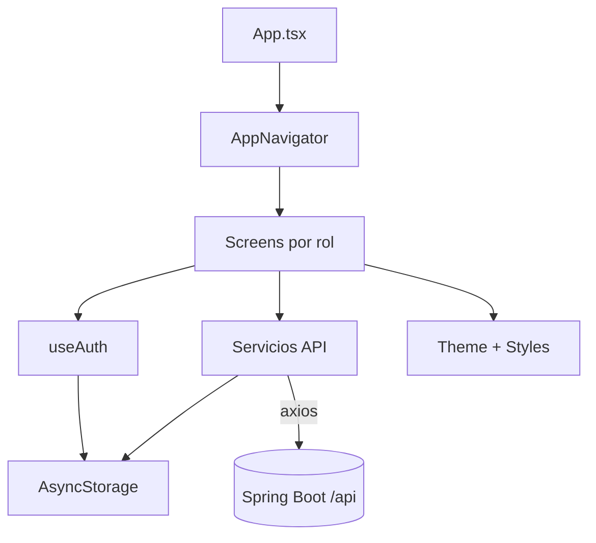

# Fase 3 · Frontend y conexión API (React Native)

## 1. Resumen ejecutivo
- La app Expo utiliza una pila única de `@react-navigation/native-stack` que centraliza rutas de autenticación, dashboards y flujos por rol en un único archivo, lo que facilita el arranque pero complica la evolución modular del routing.【F:alma_frontend/src/navigation/AppNavigator.tsx†L1-L108】
- La autenticación y persistencia de sesión se gestionan con un hook `useAuth` basado en `AsyncStorage`, sin un proveedor de contexto que evite lecturas repetidas ni encapsule efectos secundarios, lo que dificulta compartir estado y reaccionar a cambios globales.【F:alma_frontend/src/hooks/useAuth.ts†L1-L151】
- La configuración de `axios` añade interceptores para token JWT y limpieza de sesión, pero carece de reintentos, tracing y manejo unificado de errores de negocio; además, la auto-detección de host fuerza una IP fija en repositorio que puede romper builds multi-equipo y desaprovecha las respuestas estandarizadas por `ApiResponseAdvice` (estructura `success`, `message`, `data`).【F:alma_frontend/src/services/api.ts†L1-L173】【F:alma_frontend/src/services/apiConfig.ts†L7-L140】【F:alma_backend/alma_backend/src/main/java/com/alma/alma_backend/advice/ApiResponseAdvice.java†L1-L74】
- El backend ya consolidó capas `dto`, `mapper`, `logging` y `exceptions`, completó validaciones sincronizadas con la base de datos y publica Swagger seguro; sin embargo, el frontend no consume aún estos contratos unificados, lo que aumenta la fricción en las integraciones.【F:alma_backend/alma_backend/src/main/java/com/alma/alma_backend/dto/UsuarioResponseDTO.java†L1-L120】【F:alma_backend/alma_backend/src/main/java/com/alma/alma_backend/mapper/UsuarioMapper.java†L1-L110】【F:alma_backend/alma_backend/src/main/java/com/alma/alma_backend/logging/LoggingConfig.java†L1-L78】【F:alma_backend/alma_backend/src/main/java/com/alma/alma_backend/exceptions/GlobalExceptionHandler.java†L20-L59】【F:alma_backend/alma_backend/src/main/java/com/alma/alma_backend/config/SecurityConfig.java†L43-L87】
- Existen incongruencias entre rutas consumidas y endpoints reales del backend (`/profesionales/**` vs `/api/profesional/**`, `/pacientes/mis-pacientes` en lugar de `/profesional/mis-pacientes`), generando fallos sistemáticos post-login pese a tener token válido incluso después de unificar servicios y DTOs en el backend.【F:alma_frontend/src/services/profesionalService.ts†L19-L370】【F:alma_frontend/src/services/pacienteService.ts†L117-L169】【F:alma_backend/alma_backend/src/main/java/com/alma/alma_backend/controller/ProfesionalController.java†L27-L148】
- La mayoría de pantallas mezclan presentación y lógica de orquestación (fetch, validaciones y UI) sin reutilizar componentes ni estados globales, lo que multiplica código duplicado y reduce mantenibilidad.

## 2. Arquitectura del frontend actual



### 2.1 Árbol funcional (alto nivel)
- `src/navigation`: única pila `Stack` con todas las rutas, incluida navegación secundaria por roles.【F:alma_frontend/src/navigation/AppNavigator.tsx†L1-L108】
- `src/screens`: vistas separadas por dominio (`Auth`, `Admin`, `Profesional`, `SuperAdmin`), pero cada carpeta contiene lógica de datos propia (fetch, validaciones, alerts).
- `src/services`: capa de acceso a API sobre `axios`, con un archivo por agregado (auth, usuarios, organizaciones, asignaciones, profesionales, pacientes).【F:alma_frontend/src/services/profesionalService.ts†L19-L373】【F:alma_frontend/src/services/pacienteService.ts†L17-L200】
- `src/hooks`: solo `useAuth`, responsable de sincronizar `AsyncStorage` y exponer helpers de rol.【F:alma_frontend/src/hooks/useAuth.ts†L1-L151】
- `src/components`: utilidades específicas como `RoleGuard`, pero sin adopción generalizada en pantallas para ocultar contenido por rol.【F:alma_frontend/src/components/RoleGuard.tsx†L1-L72】
- `src/theme` y `src/styles`: tokens y estilos por pantalla con Styled Components/StyleSheet, aunque hay mezcla de estilos inline en varias views.【F:alma_frontend/src/screens/DashboardScreen.tsx†L108-L120】

## 3. Hallazgos detallados

| Área | Observaciones | Impacto | Recomendaciones |
|------|---------------|---------|-----------------|
| Navegación | `AppNavigator` concentra más de 15 rutas en una pila única sin split por roles ni guards; la lógica de redirección post-login está en pantallas individuales.| Media: difícil añadir tabs/flows anidados y aplicar auth guards reutilizables.| Crear un `AuthNavigator` (login, forgot) y `AppNavigator` protegido. Integrar `RoleGuard` o un stack por rol (p.ej. `AdminStack`).【F:alma_frontend/src/navigation/AppNavigator.tsx†L1-L108】|
| Autenticación | `useAuth` lee tokens desde `AsyncStorage` en cada montaje de hook y expone helpers mediante funciones `useCallback`, pero no dispara refresh global al actualizar credenciales; no hay listener a eventos de expiración o cambios en storage.【F:alma_frontend/src/hooks/useAuth.ts†L19-L150】| Alta: renders redundantes, estado inconsistente al limpiar sesión desde interceptores.| Crear `AuthProvider` con `React.Context`, usar `React.Query`/`zustand` para cachear usuario y disparar `loadUserData` ante eventos (login/logout).|
| Configuración API | El `axios` interceptor limpia tokens en 401 y loguea errores, pero no propaga mensajes de negocio ni reintenta. `apiConfig` deja una IP fija `192.168.1.45:8080` comprometida al repo.【F:alma_frontend/src/services/api.ts†L44-L160】【F:alma_frontend/src/services/apiConfig.ts†L7-L54】| Alta: fallos de conexión en otros entornos; riesgo de revelar IP interna y romper builds cloud.| Leer host desde `.env` (usando `expo-constants`), añadir wrapper `handleApiError` centralizado y política de reintentos con cancel token opcional.|
| Servicios API | `profesionalService` mezcla rutas `/profesionales/*` y `/profesional/*`, pero el backend solo expone `/api/profesional/**`. `pacienteService.getMisPacientes` apunta a `/pacientes/mis-pacientes`, endpoint inexistente en backend (corresponde a `/profesional/mis-pacientes`).【F:alma_frontend/src/services/profesionalService.ts†L19-L370】【F:alma_frontend/src/services/pacienteService.ts†L150-L169】【F:alma_backend/alma_backend/src/main/java/com/alma/alma_backend/controller/ProfesionalController.java†L27-L148】| Alta: las pantallas de profesionales fallan automáticamente con 404/403. | Introducir constants de endpoints sincronizados con OpenAPI, reutilizar los DTOs unificados del backend y refactorizar servicios para usar `/profesional/**` y métodos específicos (`getMisPacientesDetalle`).|
| Gestión de errores | Las pantallas usan `Alert.alert` directamente tras cada llamada, sin estados de error reutilizables ni feedback UI (loader, retry). Ej.: `GestionOrganizacionesScreen` mezcla fetch, control de modal y UI en un solo archivo de >200 líneas.【F:alma_frontend/src/screens/SuperAdmin/GestionOrganizacionesScreen.tsx†L1-L189】| Media: duplicación y UX inconsistente.| Crear hooks específicos (`useFetchOrganizaciones`, `useMutation` con React Query) y componentes de `ErrorState`/`EmptyState` compartidos.|
| Seguridad | Tokens JWT se guardan en `AsyncStorage`, vulnerable a extracción en dispositivos rooteados. No hay refresh token ni verificación de expiración. `authService` loguea credenciales y respuestas completas en consola.【F:alma_frontend/src/services/authService.ts†L11-L124】| Alta: riesgo de exposición de credenciales y tokens, incumplimiento de mejores prácticas móviles.| Migrar a `expo-secure-store` o `react-native-keychain`, eliminar logs sensibles y añadir expiración/refresh basado en claims.|
| UX Flujos críticos | `DashboardScreen` consulta `AsyncStorage` manualmente para detectar rol y contraseña temporal, lanzando `Alert` cada 5 minutos sin opción de recordar. No hay skeletons ni placeholders en listados (FlatList sin `refreshControl`).【F:alma_frontend/src/screens/DashboardScreen.tsx†L19-L119】| Media: experiencia inconsistente, accesibilidad limitada.| Reemplazar polling por estado derivado (`authContext.passwordTemporal`), agregar componentes `Loader`, `EmptyState`, accesibilidad (TalkBack labels) y validaciones de formularios con `react-hook-form`.|

## 4. Conexión con el backend
- **Autenticación**: las rutas `/auth/login` y `/auth/register/organization` coinciden con `AuthenticationController`, pero `authService` devuelve mensajes genéricos sin mapear códigos específicos del backend (p.ej. bloqueo 423) ni aprovechar los campos de `ApiResponseAdvice`.【F:alma_frontend/src/services/authService.ts†L42-L74】【F:alma_backend/alma_backend/src/main/java/com/alma/alma_backend/advice/ApiResponseAdvice.java†L1-L74】
- **Profesionales**: el backend expone `GET /api/profesional/mis-pacientes`, `/mis-pacientes-detalle`, `/mis-estadisticas`, `/organizacion/todos`, etc.; el frontend mezcla singular/plural, originando 404/403 tras login de profesional o admin aun cuando las entidades y DTOs están sincronizados con la base de datos.【F:alma_backend/alma_backend/src/main/java/com/alma/alma_backend/controller/ProfesionalController.java†L27-L160】【F:alma_frontend/src/services/profesionalService.ts†L19-L310】【F:bd/V9__Fase6_Recursos_Multimedia_Informes.sql†L11-L179】
- **Pacientes**: los listados generales usan `/pacientes` (correcto), pero `getMisPacientes` debería delegar en `profesionalService.getMisPacientesDetalle` para respetar la preautorización del backend y los nuevos validadores de dominio.【F:alma_frontend/src/services/pacienteService.ts†L150-L169】【F:alma_backend/alma_backend/src/main/java/com/alma/alma_backend/controller/ProfesionalController.java†L55-L101】【F:alma_backend/alma_backend/src/main/java/com/alma/alma_backend/exceptions/DomainRuleViolationException.java†L1-L50】
- **Auditoría y organizaciones**: las rutas consumidas (`/organizaciones/auditoria/recientes`, `/organizaciones/{id}/auditoria`) coinciden con el controller del backend; sin embargo, la pantalla de super-admin no limita las llamadas concurrentes ni cachea resultados.【F:alma_frontend/src/services/auditoriaService.ts†L9-L25】

## 5. Gestión de estado y seguridad
- No existe un store global (Redux/Context/Zustand); cada pantalla vuelve a invocar servicios y mantiene su propio loading/error. Esto impide cachear datos comunes (organización, perfil) y provoca parpadeos al cambiar de pantalla.
- `AsyncStorage` se usa tanto en interceptores como en componentes para leer token/rol; no hay invalidación centralizada. Migrar a un `AuthContext` + `React Query` permitiría compartir el cache y disparar refetch cuando el interceptor limpie tokens.【F:alma_frontend/src/services/api.ts†L48-L158】【F:alma_frontend/src/hooks/useAuth.ts†L19-L150】
- Considerar `expo-secure-store` para token y `expo-auth-session` si se integra OAuth a futuro. Añadir verificación de expiración en `useAuth` leyendo `exp` del JWT y forzando logout anticipado.

## 6. UX y navegación
- `DashboardScreen` delega en componentes por rol pero carece de fallback visual cuando no hay datos o el rol es nulo; el manejo de contraseña temporal se basa en `Alert` periódica en lugar de banner persistente.【F:alma_frontend/src/screens/DashboardScreen.tsx†L24-L119】
- Pantallas como `GestionOrganizacionesScreen` usan `Alert` para errores y `ActivityIndicator` simple, sin componentes reutilizables ni patrones de retry.【F:alma_frontend/src/screens/SuperAdmin/GestionOrganizacionesScreen.tsx†L24-L189】
- `RoleGuard` existe pero no se aplica en la navegación principal; permitiría ocultar botones de acciones no permitidas dentro de dashboards.【F:alma_frontend/src/components/RoleGuard.tsx†L1-L72】

## 7. Recomendaciones y propuestas de refactor

### 7.1 Modularizar navegación por dominio
```tsx
// src/navigation/index.tsx
export const AppRouter = () => (
  <NavigationContainer>
    <RootStack.Navigator screenOptions={{headerShown: false}}>
      <RootStack.Screen name="Splash" component={SplashScreen} />
      <RootStack.Screen name="Auth" component={AuthNavigator} />
      <RootStack.Screen name="App" component={ProtectedNavigator} />
    </RootStack.Navigator>
  </NavigationContainer>
);

const ProtectedNavigator = () => {
  const {isAuthenticated, userRole} = useAuthContext();
  if (!isAuthenticated) return <Redirect to="Auth" />;
  return (
    <RoleSwitch role={userRole} /> // retorna stacks por rol
  );
};
```
- Permite aislar stacks por rol y reutilizar `RoleGuard` en screens compartidas.

### 7.2 Contexto de autenticación y cache de usuario
```tsx
// src/contexts/AuthContext.tsx
const AuthContext = createContext<AuthState>(initialState);

export const AuthProvider: React.FC = ({children}) => {
  const queryClient = useQueryClient();
  const {data: session, isLoading} = useQuery(['session'], authService.getSession, {
    staleTime: 5 * 60 * 1000,
    retry: false,
  });

  const loginMutation = useMutation(authService.login, {
    onSuccess: data => {
      secureStore.save('jwt', data.access_token);
      queryClient.invalidateQueries(['session']);
    },
  });

  return (
    <AuthContext.Provider value={{session, isLoading, login: loginMutation.mutate}}>
      {children}
    </AuthContext.Provider>
  );
};
```
- Centraliza session, permite invalidar cache cuando el interceptor reciba 401.

### 7.3 Normalizar servicios y endpoints
- Crear `src/services/endpoints.ts` con constantes generadas desde OpenAPI (`/profesional`, `/pacientes`, `/organizaciones`). Los servicios consumen `api.get(ENDPOINTS.profesional.misEstadisticas)` evitando strings duplicados.
- Migrar `pacienteService.getMisPacientes` a reutilizar `profesionalService.getMisPacientesDetalle()` y eliminar rutas inexistentes.【F:alma_frontend/src/services/pacienteService.ts†L150-L169】
- Añadir tipado fuerte a respuestas usando `zod` o `io-ts` para validar payloads antes de enviarlos a UI.

### 7.4 Manejo centralizado de errores y loaders
```tsx
// src/components/feedback/ErrorBoundary.tsx
export const ErrorState = ({message, onRetry}) => (
  <View style={styles.container}>
    <Text>{message}</Text>
    {onRetry && <Button title="Reintentar" onPress={onRetry} />}
  </View>
);
```
- Reemplazar `Alert.alert` por componentes declarativos con retry para listas (`FlatList ListEmptyComponent`).

### 7.5 Seguridad móvil
- Sustituir `AsyncStorage` por `expo-secure-store` y envolver lecturas/escrituras en util `secureStorage.ts`.
- Eliminar logs de credenciales en `authService` y aplicar mascarado antes de imprimir errores.【F:alma_frontend/src/services/authService.ts†L11-L124】
- Añadir refresh token (si backend lo soporta) o logout automático cuando `jwt` expira (decodificar `exp`).

### 7.6 Mejora UX flujos críticos
- Crear banners persistentes para recordatorio de contraseña temporal en lugar de alertas periódicas, y un flujo guiado para cambio de password dentro del dashboard.【F:alma_frontend/src/screens/DashboardScreen.tsx†L24-L119】
- Integrar `react-hook-form` + `yup` en formularios de login/registro para validaciones declarativas y mensajes accesibles.
- Añadir placeholders y paginación en listados largos (profesionales, organizaciones) para reducir carga inicial.

## 8. Plan de acción priorizado
1. **Corregir endpoints críticos** (`profesionalService`, `pacienteService`) y centralizar constantes antes de pruebas de integración con backend, respetando los DTOs unificados y las respuestas de `ApiResponseAdvice`.【F:alma_frontend/src/services/profesionalService.ts†L19-L370】【F:alma_frontend/src/services/pacienteService.ts†L150-L169】【F:alma_backend/alma_backend/src/main/java/com/alma/alma_backend/advice/ApiResponseAdvice.java†L1-L74】
2. **Introducir AuthContext + storage seguro**, eliminando logs sensibles y duplicación de lecturas de `AsyncStorage` y adaptando el manejo de errores al nuevo esquema `success/message/data`.【F:alma_frontend/src/hooks/useAuth.ts†L19-L150】【F:alma_frontend/src/services/authService.ts†L11-L124】【F:alma_backend/alma_backend/src/main/java/com/alma/alma_backend/advice/ApiResponseAdvice.java†L1-L74】
3. **Modularizar navegación por rol** y aplicar `RoleGuard`/stacks separados para mejorar mantenibilidad y pruebas de UX.【F:alma_frontend/src/navigation/AppNavigator.tsx†L1-L108】
4. **Adoptar React Query o estado compartido** para cache de datos y manejo estandarizado de loaders/errores en pantallas de administración.【F:alma_frontend/src/screens/SuperAdmin/GestionOrganizacionesScreen.tsx†L24-L189】
5. **Refinar UX y accesibilidad**: banners, toasts, placeholders y validaciones de formularios consistentes.

---
**Estado:** Fase completada.
