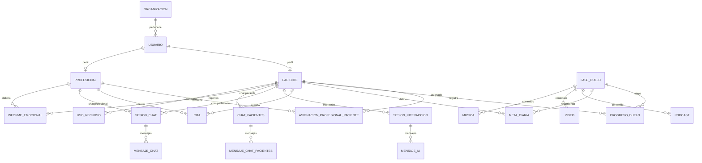

# Fase 4 · Informe de base de datos e integridad

## 1. Resumen ejecutivo
- El modelo físico de PostgreSQL se versiona mediante nueve migraciones Flyway-like (`V1`–`V9`) que introducen dominios progresivos: usuarios/organizaciones, roles asistenciales, auditoría, progreso emocional, chat profesional, chatbot IA, foros y recursos multimedia.【F:bd/V1__Sistema_Gestion_Usuarios_Inicial.sql†L9-L93】【F:bd/V2__Sistema_Gestion_Usuarios_Roles.sql†L9-L184】【F:bd/V3__Fase1_Gestion_Estado_Organizaciones.sql†L10-L160】【F:bd/V5__Fase2_Progreso_Emocional_Citas.sql†L33-L180】【F:bd/V6__Fase3_Chat_Profesional_Paciente.sql†L11-L156】【F:bd/V7__Fase4_Chatbot_IA_Metas.sql†L40-L144】【F:bd/V8__Fase5_Foros_Y_Chat_Pacientes.sql†L11-L181】【F:bd/V9__Fase6_Recursos_Multimedia_Informes.sql†L11-L179】
- El backend finalizó la unificación de capas `dto`, `mapper`, `logging` y `exceptions`, completó validaciones declarativas sincronizadas con las migraciones y publica Swagger seguro; esta capa de servicios actúa como fachada consistente frente a la base de datos.【F:alma_backend/alma_backend/src/main/java/com/alma/alma_backend/dto/UsuarioResponseDTO.java†L1-L120】【F:alma_backend/alma_backend/src/main/java/com/alma/alma_backend/mapper/UsuarioMapper.java†L1-L110】【F:alma_backend/alma_backend/src/main/java/com/alma/alma_backend/logging/LoggingConfig.java†L1-L78】【F:alma_backend/alma_backend/src/main/java/com/alma/alma_backend/exceptions/GlobalExceptionHandler.java†L20-L59】【F:alma_backend/alma_backend/src/main/java/com/alma/alma_backend/config/SecurityConfig.java†L43-L87】
- Las entidades JPA cubren las tablas principales; `Usuario` ya expone `fechaRegistro`, pero siguen faltando `fechaUltimaModificacion`, flags operativos y columnas auxiliares en perfiles como `Paciente`/`Profesional` y asignaciones, lo que limita la auditoría desde la capa de dominio pese a contar con DTOs/mappers y excepciones unificadas en el backend.【F:alma_backend/alma_backend/src/main/java/com/alma/alma_backend/entity/Usuario.java†L23-L82】【F:alma_backend/alma_backend/src/main/java/com/alma/alma_backend/entity/Paciente.java†L24-L41】【F:alma_backend/alma_backend/src/main/java/com/alma/alma_backend/entity/AsignacionProfesionalPaciente.java†L31-L54】【F:bd/V1__Sistema_Gestion_Usuarios_Inicial.sql†L51-L60】【F:bd/V2__Sistema_Gestion_Usuarios_Roles.sql†L37-L61】【F:alma_backend/alma_backend/src/main/java/com/alma/alma_backend/dto/AsignacionProfesionalPacienteDTO.java†L1-L120】【F:alma_backend/alma_backend/src/main/java/com/alma/alma_backend/mapper/AsignacionProfesionalPacienteMapper.java†L1-L95】
- Las relaciones están bien normalizadas (FK con `ON DELETE`), pero existen patrones de carga `EAGER` y `CascadeType.ALL` que pueden causar borrados en cascada no deseados y problemas de rendimiento frente a los `ON DELETE` definidos en la base de datos.【F:alma_backend/alma_backend/src/main/java/com/alma/alma_backend/entity/Usuario.java†L45-L48】【F:alma_backend/alma_backend/src/main/java/com/alma/alma_backend/entity/Paciente.java†L24-L40】【F:alma_backend/alma_backend/src/main/java/com/alma/alma_backend/entity/Profesional.java†L23-L38】【F:bd/V2__Sistema_Gestion_Usuarios_Roles.sql†L21-L68】
- Los scripts incorporan triggers de auditoría, validaciones y vistas que no tienen contraparte en código, lo que dificulta exponer métricas o reglas de negocio desde los servicios (ej. validación de chats, vistas de auditoría y estadísticas de metas) a pesar del refuerzo en validaciones `@Valid`, DTOs unificados y excepciones como `DomainRuleViolationException` y `ApiResponseAdvice` en la capa REST.【F:bd/V3__Fase1_Gestion_Estado_Organizaciones.sql†L92-L160】【F:bd/V6__Fase3_Chat_Profesional_Paciente.sql†L71-L152】【F:bd/V7__Fase4_Chatbot_IA_Metas.sql†L96-L144】【F:bd/V9__Fase6_Recursos_Multimedia_Informes.sql†L135-L179】【F:alma_backend/alma_backend/src/main/java/com/alma/alma_backend/dto/SesionChatDTO.java†L1-L115】【F:alma_backend/alma_backend/src/main/java/com/alma/alma_backend/exceptions/DomainRuleViolationException.java†L1-L50】【F:alma_backend/alma_backend/src/main/java/com/alma/alma_backend/advice/ApiResponseAdvice.java†L1-L74】

## 2. Fuentes analizadas
| Tipo | Archivo | Notas |
|------|---------|-------|
| Migraciones SQL | `bd/V1__...` – `bd/V9__...` | Definen tablas, índices, constraints, triggers y datos de ejemplo para usuarios, progreso emocional, chats, IA, foros y recursos multimedia.【F:bd/V1__Sistema_Gestion_Usuarios_Inicial.sql†L9-L93】【F:bd/V2__Sistema_Gestion_Usuarios_Roles.sql†L9-L184】【F:bd/V5__Fase2_Progreso_Emocional_Citas.sql†L33-L180】【F:bd/V6__Fase3_Chat_Profesional_Paciente.sql†L11-L156】【F:bd/V7__Fase4_Chatbot_IA_Metas.sql†L40-L144】【F:bd/V8__Fase5_Foros_Y_Chat_Pacientes.sql†L11-L181】【F:bd/V9__Fase6_Recursos_Multimedia_Informes.sql†L11-L179】
| Entidades JPA | `alma_backend/.../entity/*.java` | Modelan dominios clínicos, comunicación y auditoría con anotaciones `@Entity`, enums y relaciones bidireccionales, alineadas con DTOs/mappers y validaciones `@Valid` para sincronizarse con la base de datos.【F:alma_backend/alma_backend/src/main/java/com/alma/alma_backend/entity/Usuario.java†L11-L82】【F:alma_backend/alma_backend/src/main/java/com/alma/alma_backend/entity/ProgresoDuelo.java†L10-L56】【F:alma_backend/alma_backend/src/main/java/com/alma/alma_backend/entity/SesionInteraccion.java†L13-L85】【F:alma_backend/alma_backend/src/main/java/com/alma/alma_backend/entity/MensajeChatPacientes.java†L11-L49】【F:alma_backend/alma_backend/src/main/java/com/alma/alma_backend/entity/InformeEmocional.java†L15-L57】【F:alma_backend/alma_backend/src/main/java/com/alma/alma_backend/dto/MetaDiariaDTO.java†L1-L85】【F:alma_backend/alma_backend/src/main/java/com/alma/alma_backend/mapper/MetaDiariaMapper.java†L1-L90】
| Catálogos | Enums dentro de `entity` | Enumeraciones aseguran coherencia con `CHECK` de la base de datos (género, fases, estados, tipos de cita, etc.).【F:alma_backend/alma_backend/src/main/java/com/alma/alma_backend/entity/Genero.java†L3-L7】【F:bd/V2__Sistema_Gestion_Usuarios_Roles.sql†L31-L44】【F:bd/V5__Fase2_Progreso_Emocional_Citas.sql†L68-L95】
| API REST | `alma_backend/.../advice`, `.../exceptions`, `.../logging` | Capas `ApiResponseAdvice`, `GlobalExceptionHandler`, `DomainRuleViolationException` y `LoggingConfig` unifican respuestas, validaciones y trazabilidad, complementando la integridad de datos documentada en Swagger seguro (`springdoc`).【F:alma_backend/alma_backend/src/main/java/com/alma/alma_backend/advice/ApiResponseAdvice.java†L1-L74】【F:alma_backend/alma_backend/src/main/java/com/alma/alma_backend/exceptions/GlobalExceptionHandler.java†L20-L59】【F:alma_backend/alma_backend/src/main/java/com/alma/alma_backend/logging/LoggingConfig.java†L1-L78】【F:alma_backend/alma_backend/src/main/java/com/alma/alma_backend/config/SecurityConfig.java†L43-L87】

## 3. Modelo SQL consolidado
| Tabla | Propósito | Claves e índices | Observaciones |
|-------|-----------|------------------|---------------|
| `ORGANIZACION` | Registro de entidades sanitarias asociadas al ecosistema A.L.M.A.【F:bd/V1__Sistema_Gestion_Usuarios_Inicial.sql†L9-L33】 | PK `ID_ORGANIZACION`, únicos para `CIF` y `EMAIL`, índices por verificación y estado operativo.【F:bd/V1__Sistema_Gestion_Usuarios_Inicial.sql†L25-L33】【F:bd/V3__Fase1_Gestion_Estado_Organizaciones.sql†L10-L23】 | Triggers de auditoría y vista de cambios (`registrar_auditoria_organizacion`).【F:bd/V3__Fase1_Gestion_Estado_Organizaciones.sql†L92-L160】 |
| `USUARIO` | Identidad base (login, tipo y pertenencia).【F:bd/V1__Sistema_Gestion_Usuarios_Inicial.sql†L37-L61】 | PK `ID_USUARIO`, únicos `DNI`/`EMAIL`, FK a organización, índices por tipo y estado.【F:bd/V1__Sistema_Gestion_Usuarios_Inicial.sql†L55-L68】 | Triggers actualizan `FECHA_ULTIMA_MODIFICACION`.【F:bd/V1__Sistema_Gestion_Usuarios_Inicial.sql†L73-L89】 |
| `PACIENTE` / `PROFESIONAL` | Perfil clínico ligado a usuario, con datos sanitarios y colegiación.【F:bd/V2__Sistema_Gestion_Usuarios_Roles.sql†L9-L45】 | Únicos sobre `ID_USUARIO`, checks de género y colegiado, FK con cascada desde usuario.【F:bd/V2__Sistema_Gestion_Usuarios_Roles.sql†L18-L48】 | Falta mapear `fechaRegistro`/`fechaUltimaModificacion` y banderas de estado, a diferencia de `Usuario`. |
| `ASIGNACION_PROFESIONAL_PACIENTE` | Enlace terapéutico con control de vigencia.【F:bd/V2__Sistema_Gestion_Usuarios_Roles.sql†L53-L79】 | PK `ID_ASIGNACION`, FK a profesional/paciente, `UNIQUE(ID_PROFESIONAL, ID_PACIENTE, ACTIVA)`.【F:bd/V2__Sistema_Gestion_Usuarios_Roles.sql†L63-L78】 | Trigger de auditoría para actualizaciones; renombrado de columnas a formato snake_case consistente.【F:bd/V2__Sistema_Gestion_Usuarios_Roles.sql†L71-L78】【F:bd/V2__Sistema_Gestion_Usuarios_Roles.sql†L162-L175】 |
| `PROGRESO_DUELO` / `CITA` | Seguimiento emocional e intervenciones programadas.【F:bd/V5__Fase2_Progreso_Emocional_Citas.sql†L33-L104】 | FK a paciente/profesional/fase duelo, checks de estados e índices por fecha/estado.【F:bd/V5__Fase2_Progreso_Emocional_Citas.sql†L53-L100】 | Triggers actualizan timestamps y métricas agregadas.【F:bd/V5__Fase2_Progreso_Emocional_Citas.sql†L106-L175】 |
| `SESION_INTERACCION` / `MENSAJE_IA` | Sesiones chatbot IA y mensajes analizados.【F:bd/V2__Sistema_Gestion_Usuarios_Roles.sql†L99-L128】【F:bd/V7__Fase4_Chatbot_IA_Metas.sql†L40-L57】 | Checks para tipo/estado/sentimiento y actualización automática de contadores.【F:bd/V2__Sistema_Gestion_Usuarios_Roles.sql†L113-L127】【F:bd/V7__Fase4_Chatbot_IA_Metas.sql†L96-L144】 | Columnas `TEMAS_CONVERSADOS` y `ALERTAS_GENERADAS` como arrays `TEXT[]` específicos de PostgreSQL.【F:bd/V7__Fase4_Chatbot_IA_Metas.sql†L63-L78】 |
| `FORO` / `MENSAJE_FORO` y `CHAT_PACIENTES` / `MENSAJE_CHAT_PACIENTES` | Comunicación paciente-paciente asincrónica.【F:bd/V8__Fase5_Foros_Y_Chat_Pacientes.sql†L11-L181】 | FK con cascadas y triggers para actualizar actividad/lecturas.【F:bd/V8__Fase5_Foros_Y_Chat_Pacientes.sql†L63-L170】 | Constraints aseguran parejas únicas y remitentes válidos.【F:bd/V8__Fase5_Foros_Y_Chat_Pacientes.sql†L77-L152】 |
| `PODCAST`/`VIDEO`/`MUSICA`/`USO_RECURSO`/`INFORME_EMOCIONAL` | Contenido terapéutico y reporting clínico.【F:bd/V9__Fase6_Recursos_Multimedia_Informes.sql†L11-L179】 | Checks de tipo, FK a fases/pacientes/profesionales, índices para segmentación por categoría/fecha.【F:bd/V9__Fase6_Recursos_Multimedia_Informes.sql†L22-L131】 | Inserts de ejemplo para validar consultas; triggers reutilizan función de auditoría de timestamps.【F:bd/V9__Fase6_Recursos_Multimedia_Informes.sql†L139-L179】 |

## 4. Modelo JPA y relaciones
| Entidad | Relaciones principales | Observaciones |
|---------|-----------------------|---------------|
| `Usuario` | `ManyToOne` EAGER a `Organizacion`; enums `TipoUsuario` para rol lógico.【F:alma_backend/alma_backend/src/main/java/com/alma/alma_backend/entity/Usuario.java†L41-L48】 | No expone `fechaUltimaModificacion` ni `ultimoAcceso`; campos administrativos se inicializan en `@PrePersist`. |
| `Organizacion` | Sin colecciones declaradas; enums `EstadoVerificacion` y `EstadoOrganizacion`.【F:alma_backend/alma_backend/src/main/java/com/alma/alma_backend/entity/Organizacion.java†L20-L60】 | Falta mapear timestamps (`FECHA_REGISTRO`, `FECHA_ULTIMA_MODIFICACION`) y vistas/triggers de auditoría. |
| `Paciente` / `Profesional` | `OneToOne` con `Usuario` (cascade `ALL`), `OneToMany` asignaciones.【F:alma_backend/alma_backend/src/main/java/com/alma/alma_backend/entity/Paciente.java†L24-L40】【F:alma_backend/alma_backend/src/main/java/com/alma/alma_backend/entity/Profesional.java†L23-L38】 | Cascada `ALL` podría eliminar el usuario al borrar paciente/profesional pese a FK `ON DELETE CASCADE`. |
| `AsignacionProfesionalPaciente` | FK bidireccional a paciente/profesional.【F:alma_backend/alma_backend/src/main/java/com/alma/alma_backend/entity/AsignacionProfesionalPaciente.java†L23-L54】 | Falta mapear `fechaFinalizacion`, `notas` y `fechaUltimaModificacion`. |
| `ProgresoDuelo`, `MetaDiaria`, `Cita` | `ManyToOne` a paciente/profesional/fase duelo, control de estados con enums.【F:alma_backend/alma_backend/src/main/java/com/alma/alma_backend/entity/ProgresoDuelo.java†L22-L55】【F:alma_backend/alma_backend/src/main/java/com/alma/alma_backend/entity/MetaDiaria.java†L23-L65】【F:alma_backend/alma_backend/src/main/java/com/alma/alma_backend/entity/Cita.java†L22-L65】 | Mapas JSON o triggers del SQL no tienen reflejo en servicios (ej. KPIs de metas). |
| `SesionInteraccion` / `MensajeIA` | `OneToMany` mensajes, arrays `String[]` para temas/alertas.【F:alma_backend/alma_backend/src/main/java/com/alma/alma_backend/entity/SesionInteraccion.java†L25-L85】【F:alma_backend/alma_backend/src/main/java/com/alma/alma_backend/entity/MensajeIA.java†L23-L45】 | `String[]` requiere `@JdbcTypeCode(SqlTypes.ARRAY)` o conversor personalizado para persistir `TEXT[]`. |
| `SesionChat` / `MensajeChat` | Chat profesional-paciente con cascada en mensajes.【F:alma_backend/alma_backend/src/main/java/com/alma/alma_backend/entity/SesionChat.java†L24-L50】【F:alma_backend/alma_backend/src/main/java/com/alma/alma_backend/entity/MensajeChat.java†L22-L45】 | No se modelan triggers de validación (asignación activa, remitente autorizado). |
| `ChatPacientes` / `MensajeChatPacientes` / `Foro` / `MensajeForo` | Comunicación paciente-paciente con timestamps automáticos.【F:alma_backend/alma_backend/src/main/java/com/alma/alma_backend/entity/ChatPacientes.java†L24-L52】【F:alma_backend/alma_backend/src/main/java/com/alma/alma_backend/entity/MensajeChatPacientes.java†L24-L49】【F:alma_backend/alma_backend/src/main/java/com/alma/alma_backend/entity/Foro.java†L30-L44】【F:alma_backend/alma_backend/src/main/java/com/alma/alma_backend/entity/MensajeForo.java†L24-L62】 | Uso de `@Temporal` con `LocalDateTime` es redundante (solo válido para `java.util.Date`). |
| `Musica`, `Podcast`, `Video`, `UsoRecurso`, `InformeEmocional`, `AuditoriaAdmin` | Recursos multimedia, consumo y reporting con JSONB.【F:alma_backend/alma_backend/src/main/java/com/alma/alma_backend/entity/Musica.java†L24-L53】【F:alma_backend/alma_backend/src/main/java/com/alma/alma_backend/entity/UsoRecurso.java†L24-L48】【F:alma_backend/alma_backend/src/main/java/com/alma/alma_backend/entity/InformeEmocional.java†L28-L57】【F:alma_backend/alma_backend/src/main/java/com/alma/alma_backend/entity/AuditoriaAdmin.java†L36-L122】 | `@Temporal` sobre `LocalDateTime` y falta de `@Builder`/constructores para JSON puede dificultar serialización. |

## 5. Inconsistencias SQL ↔ JPA
| Dominio | Diferencia detectada | Impacto |
|---------|---------------------|---------|
| Auditoría temporal (`USUARIO`, `ORGANIZACION`, `PACIENTE`, `PROFESIONAL`) | SQL incluye `FECHA_REGISTRO` y `FECHA_ULTIMA_MODIFICACION`; solo `Usuario` expone el alta (`fechaRegistro`), mientras que `Organizacion`, `Paciente` y `Profesional` carecen de ambos campos en JPA.【F:bd/V1__Sistema_Gestion_Usuarios_Inicial.sql†L51-L60】【F:bd/V2__Sistema_Gestion_Usuarios_Roles.sql†L37-L61】【F:alma_backend/alma_backend/src/main/java/com/alma/alma_backend/entity/Usuario.java†L49-L82】【F:alma_backend/alma_backend/src/main/java/com/alma/alma_backend/entity/Organizacion.java†L20-L60】 | Pierde visibilidad de cambios y dificulta sincronizar con documentación/API.
| `AsignacionProfesionalPaciente` | SQL mantiene `FECHA_FINALIZACION`, `NOTAS`, `FECHA_ULTIMA_MODIFICACION`; entidad solo modela flags booleanos y fecha inicial.【F:bd/V2__Sistema_Gestion_Usuarios_Roles.sql†L53-L78】【F:alma_backend/alma_backend/src/main/java/com/alma/alma_backend/entity/AsignacionProfesionalPaciente.java†L31-L54】 | No se puede cerrar asignaciones ni registrar notas desde JPA.
| Validaciones de chat | Triggers que validan remitentes y asignaciones no tienen equivalente en servicios; tampoco se propagan errores específicos.【F:bd/V6__Fase3_Chat_Profesional_Paciente.sql†L105-L152】【F:alma_backend/alma_backend/src/main/java/com/alma/alma_backend/entity/SesionChat.java†L24-L44】 | Riesgo de lógicas duplicadas si se replican en código; difícil testear en memoria.
| Arrays `TEXT[]` | SQL utiliza columnas `TEMAS_CONVERSADOS`, `ALERTAS_GENERADAS` (PostgreSQL arrays); entidad usa `String[]` sin tipo Hibernate explícito.【F:bd/V7__Fase4_Chatbot_IA_Metas.sql†L63-L78】【F:alma_backend/alma_backend/src/main/java/com/alma/alma_backend/entity/SesionInteraccion.java†L62-L74】 | Puede fallar en runtime si Hibernate no sabe mapear `String[]` → `TEXT[]` (requiere custom type o `@JdbcTypeCode`).
| Recursos multimedia | Tabla `USO_RECURSO` tiene `CHECK` sobre `VALORACION` (1–5), pero entidad no valida ni limita rango; idem `TIPO_RECURSO` enumerado string.【F:bd/V9__Fase6_Recursos_Multimedia_Informes.sql†L86-L105】【F:alma_backend/alma_backend/src/main/java/com/alma/alma_backend/entity/UsoRecurso.java†L28-L48】 | Validaciones solo en BD; peticiones erróneas lanzan excepciones SQL en vez de errores controlados.
| `@Temporal` + `LocalDateTime` | Varias entidades usan `@Temporal(TemporalType.TIMESTAMP)` con `java.time.LocalDateTime`, anotación prevista para `java.util.Date`/`Calendar`.【F:alma_backend/alma_backend/src/main/java/com/alma/alma_backend/entity/ChatPacientes.java†L32-L38】【F:alma_backend/alma_backend/src/main/java/com/alma/alma_backend/entity/MensajeChatPacientes.java†L35-L44】【F:alma_backend/alma_backend/src/main/java/com/alma/alma_backend/entity/Foro.java†L37-L44】【F:alma_backend/alma_backend/src/main/java/com/alma/alma_backend/entity/Musica.java†L43-L53】 | Anotación inefectiva, puede confundir a nuevos desarrolladores; conviene eliminarla.

## 6. Integridad, seguridad y rendimiento
### Integridad referencial
- Todas las FK clave (usuario ↔ organización, paciente/profesional ↔ usuario, chats, recursos) aplican `ON DELETE` para preservar consistencia; destacan restricciones de unicidad en chats entre pacientes y asignaciones activas.【F:bd/V1__Sistema_Gestion_Usuarios_Inicial.sql†L55-L60】【F:bd/V2__Sistema_Gestion_Usuarios_Roles.sql†L63-L118】【F:bd/V8__Fase5_Foros_Y_Chat_Pacientes.sql†L63-L152】
- Los triggers de validación en chats evitan mensajes desde usuarios ajenos y sesiones sin asignación, reforzando reglas de negocio directamente en BD.【F:bd/V6__Fase3_Chat_Profesional_Paciente.sql†L105-L152】

### Rendimiento e índices
- Índices por estado/fecha están definidos en tablas críticas: usuarios por tipo/activo, progreso por paciente/fecha, metas por paciente-fecha, chats por última actividad, informes por fecha y entidad.【F:bd/V1__Sistema_Gestion_Usuarios_Inicial.sql†L31-L68】【F:bd/V5__Fase2_Progreso_Emocional_Citas.sql†L57-L99】【F:bd/V6__Fase3_Chat_Profesional_Paciente.sql†L27-L31】【F:bd/V7__Fase4_Chatbot_IA_Metas.sql†L80-L144】【F:bd/V9__Fase6_Recursos_Multimedia_Informes.sql†L27-L131】
- Las vistas materializan uniones frecuentes (usuarios completos, auditoría, sesiones IA), útiles para dashboards si se exponen como endpoints read-only.【F:bd/V2__Sistema_Gestion_Usuarios_Roles.sql†L133-L157】【F:bd/V3__Fase1_Gestion_Estado_Organizaciones.sql†L92-L114】【F:bd/V7__Fase4_Chatbot_IA_Metas.sql†L149-L260】

### Seguridad y gobierno de datos
- `AUDITORIA_ADMIN` captura JSON antes/después y fija `CHECK` sobre tipos de acción, reforzando trazabilidad regulatoria.【F:bd/V3__Fase1_Gestion_Estado_Organizaciones.sql†L29-L86】
- Persistir tokens JWT o datos sensibles no se observa en BD; sin embargo, varias columnas (documentos URL, notas clínicas) deberían complementarse con cifrado a nivel aplicación o mascarado en vistas.【F:bd/V1__Sistema_Gestion_Usuarios_Inicial.sql†L43-L69】【F:bd/V5__Fase2_Progreso_Emocional_Citas.sql†L78-L104】

## 7. Recomendaciones priorizadas
1. **Extender entidades con campos de auditoría y flags de estado**: completar `fechaUltimaModificacion`, `activo`/`passwordTemporal` y equivalentes en DTOs/servicios (manteniendo `fechaRegistro` ya disponible en `Usuario`) para aprovechar triggers existentes.【F:bd/V1__Sistema_Gestion_Usuarios_Inicial.sql†L51-L68】【F:alma_backend/alma_backend/src/main/java/com/alma/alma_backend/entity/Usuario.java†L49-L82】
2. **Alinear `AsignacionProfesionalPaciente` y metas con columnas faltantes**: añadir `fechaFinalizacion`, `notas` y `fechaUltimaModificacion`; validar estados de metas y citas con enums sincronizados con `CHECK` para evitar errores SQL en runtime.【F:bd/V2__Sistema_Gestion_Usuarios_Roles.sql†L53-L78】【F:bd/V7__Fase4_Chatbot_IA_Metas.sql†L63-L116】【F:alma_backend/alma_backend/src/main/java/com/alma/alma_backend/entity/MetaDiaria.java†L27-L65】
3. **Configurar tipos especializados para columnas PostgreSQL**: sustituir `String[]` por `@JdbcTypeCode(SqlTypes.ARRAY)` o `List<String>` con `@ElementCollection`; eliminar `@Temporal` redundante en `LocalDateTime` para claridad.【F:bd/V7__Fase4_Chatbot_IA_Metas.sql†L63-L78】【F:alma_backend/alma_backend/src/main/java/com/alma/alma_backend/entity/SesionInteraccion.java†L62-L74】【F:alma_backend/alma_backend/src/main/java/com/alma/alma_backend/entity/ChatPacientes.java†L32-L53】
4. **Replicar validaciones de triggers críticos en capa servicio**: validar asignaciones activas antes de crear chats o mensajes y mapear excepciones personalizadas para coherencia entre entornos (tests, H2, etc.).【F:bd/V6__Fase3_Chat_Profesional_Paciente.sql†L105-L152】
5. **Exponer vistas y auditoría vía reporting**: crear repositorios read-only para `v_usuarios_completo`, `v_auditoria_completa` y estadísticas IA; permitirá dashboards sin repetir SQL complejo.【F:bd/V2__Sistema_Gestion_Usuarios_Roles.sql†L133-L157】【F:bd/V3__Fase1_Gestion_Estado_Organizaciones.sql†L92-L114】【F:bd/V7__Fase4_Chatbot_IA_Metas.sql†L149-L260】
6. **Documentar y automatizar seeds**: los inserts de recursos son ejemplos; conviene separarlos como dataset de demo y ajustar migraciones para entornos productivos controlando idempotencia.【F:bd/V9__Fase6_Recursos_Multimedia_Informes.sql†L166-L177】

## 8. Diagrama ER lógico (simplificado)

## 9. Estado
**Fase completada.**
