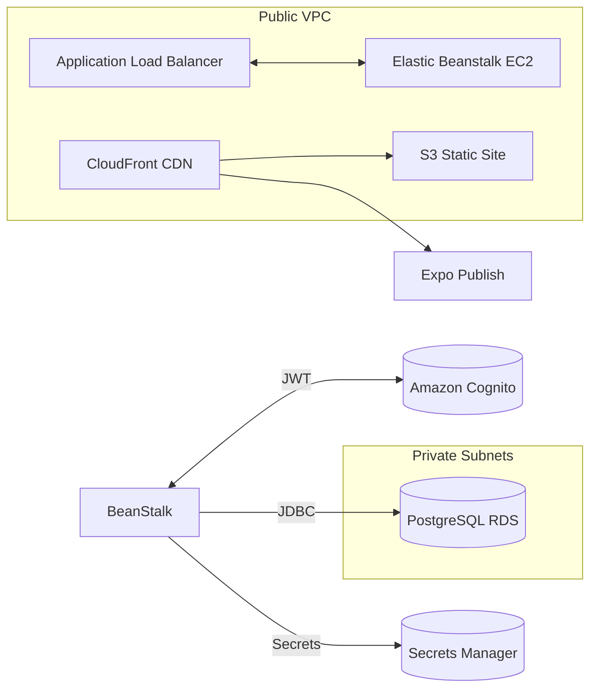
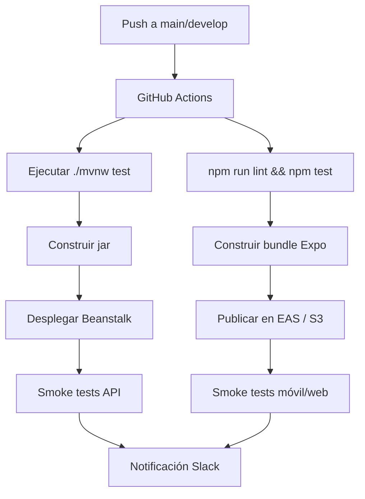

# Fase 5 · Documentación técnica, despliegue y resumen ejecutivo

## 1. Resumen ejecutivo
- Se consolida una arquitectura cloud híbrida con backend Spring Boot, frontend React Native y PostgreSQL gestionado, soportada por dependencias maduras (`spring-boot-starter-*`, JWT, SpringDoc) y empaquetado Maven/Gradle wrapper en el repositorio.【F:alma_backend/alma_backend/pom.xml†L27-L83】【F:alma_backend/alma_backend/mvnw†L1-L19】【F:alma_frontend/package.json†L3-L41】
- Las configuraciones distinguen perfiles locales, de desarrollo y producción con variables externas para credenciales, reforzando el uso de Secrets Manager / Parameter Store en despliegues reales.【F:alma_backend/alma_backend/src/main/resources/application.properties†L1-L23】【F:alma_backend/alma_backend/src/main/resources/application-prod.properties†L5-L23】【F:alma_backend/alma_backend/src/main/resources/application-inigoDev.properties†L1-L11】
- La seguridad se apoya en JWT, filtros personalizados y cabeceras endurecidas, aunque requiere rotación segura de claves y propagación de CORS dinámico para clientes móviles.【F:alma_backend/alma_backend/src/main/java/com/alma/alma_backend/config/SecurityConfig.java†L33-L92】【F:alma_backend/alma_backend/src/main/resources/application-security.properties†L9-L33】
- El modelo de datos versionado (scripts `V1`–`V9`) habilita importación incremental de dominios (usuarios, foros, métricas) y sirve como punto de partida para migraciones automatizadas en pipelines.【F:bd/V1__Sistema_Gestion_Usuarios_Inicial.sql†L9-L89】【F:bd/V5__Fase2_Progreso_Emocional_Citas.sql†L33-L175】【F:bd/V8__Fase5_Foros_Y_Chat_Pacientes.sql†L11-L170】【F:bd/V9__Fase6_Recursos_Multimedia_Informes.sql†L11-L179】

## 2. Infraestructura objetivo (AWS Free Tier)

### 2.1 Topología propuesta

- **Backend**: Elastic Beanstalk (Docker o plataforma Java 17) desplegando el `jar` generado con `mvn clean package`. Uso de Auto Scaling mínimo (1–2 instancias t3.micro) y ALB público.【F:alma_backend/alma_backend/pom.xml†L27-L83】
- **Base de datos**: Amazon RDS for PostgreSQL (db.t3.micro) en subred privada, aplicando los scripts `bd/V1`–`V9` mediante `psql` o AWS DMS para inicializar datos clínicos y de contenidos.【F:bd/V1__Sistema_Gestion_Usuarios_Inicial.sql†L9-L89】【F:bd/V5__Fase2_Progreso_Emocional_Citas.sql†L33-L175】【F:bd/V8__Fase5_Foros_Y_Chat_Pacientes.sql†L11-L170】【F:bd/V9__Fase6_Recursos_Multimedia_Informes.sql†L11-L179】
- **Frontend**: Distribución dual. Expo EAS para builds móviles y S3 + CloudFront para landing/prototipos web que consumen la misma API (orígenes permitidos en CORS).【F:alma_frontend/package.json†L5-L22】
- **Identidad y secretos**: Cognito para flujos de registro/login móviles, emitiendo tokens que luego consume el backend. Secrets Manager almacena `DB_URL`, `DB_USERNAME`, `DB_PASSWORD` y la clave JWT usada por Spring.【F:alma_backend/alma_backend/src/main/resources/application-prod.properties†L9-L19】【F:alma_backend/alma_backend/src/main/resources/application-security.properties†L17-L33】

### 2.2 Variables de entorno y configuración
| Servicio | Variable | Fuente | Uso |
|----------|----------|--------|-----|
| Backend | `DB_URL`, `DB_USERNAME`, `DB_PASSWORD` | Secrets Manager / Parameter Store | Conexión JDBC a RDS conforme al perfil `prod`.|【F:alma_backend/alma_backend/src/main/resources/application-prod.properties†L9-L19】
| Backend | `SPRING_PROFILES_ACTIVE` | Beanstalk Environment | Seleccionar perfil `prod` y cargar secretos externos.|【F:alma_backend/alma_backend/src/main/resources/application.properties†L9-L17】
| Backend | `JWT_SECRET_KEY`, `JWT_EXPIRATION_MS`, `JWT_ISSUER` | Secrets Manager | Sobrescribir propiedades sensibles hoy en `application-security.properties`. |【F:alma_backend/alma_backend/src/main/resources/application-security.properties†L11-L33】
| Frontend | `API_BASE_URL` | Expo Config (`app.config.js` o `.env`) | Apuntar a ALB/Beanstalk según entorno.|—
| CI/CD | `AWS_ACCESS_KEY_ID`, `AWS_SECRET_ACCESS_KEY`, `AWS_REGION` | GitHub Secrets | Despliegue automatizado a AWS (Beanstalk, S3, RDS).|—

### 2.3 Checklist de despliegue
1. Provisionar VPC con subredes públicas/privadas y security groups (HTTP/HTTPS para ALB, 5432 interno para RDS).
2. Crear instancia RDS PostgreSQL e importar migraciones `bd/V1`–`V9` ordenadas usando `psql -f` o herramienta de migraciones.
3. Configurar Beanstalk con plataforma Java 17, subir `alma_backend-0.0.1-SNAPSHOT.jar` y definir variables.
4. Publicar frontend móvil vía Expo EAS (`eas build --profile production`) y landing en S3/CloudFront.
5. Configurar Cognito User Pool y federación con backend mediante endpoints `/api/auth/**`.
6. Integrar Secrets Manager con Beanstalk y Lambda rotation para credenciales.
7. Activar CloudWatch Logs/Alarms para API y métricas RDS.

## 3. Pipeline de desarrollo y operación

### 3.1 Setup local
| Paso | Comando | Referencia |
|------|---------|------------|
| Clonar repositorio | `git clone <repo>` | — |
| Backend | `cd alma_backend/alma_backend && ./mvnw clean package` | Maven wrapper incluido.【F:alma_backend/alma_backend/mvnw†L1-L19】|
| Backend (run) | `./mvnw spring-boot:run` con perfil local | Configuración principal `application.properties`.|【F:alma_backend/alma_backend/src/main/resources/application.properties†L1-L23】|
| Frontend | `cd alma_frontend && npm install` | Dependencias definidas en `package.json`.【F:alma_frontend/package.json†L3-L41】|
| Frontend (dev) | `npm run start` (Metro) o `npm run android` | Scripts predefinidos.|【F:alma_frontend/package.json†L6-L19】|
| Datos demo | `psql -f bd/VX__*.sql` | Migraciones versionadas.|【F:bd/V1__Sistema_Gestion_Usuarios_Inicial.sql†L9-L89】【F:bd/V9__Fase6_Recursos_Multimedia_Informes.sql†L11-L179】|

### 3.2 Pipeline CI/CD recomendado

- **Quality gates**: Maven tests + ESLint/Jest antes de empaquetar.【F:alma_backend/alma_backend/mvnw†L1-L19】【F:alma_frontend/package.json†L6-L20】
- **Infra as Code**: Plantillas Terraform/CloudFormation para VPC, RDS, Beanstalk, S3.
- **Observabilidad**: Integrar AWS CloudWatch / X-Ray, enviar métricas de progreso emocional y chats para dashboards clínicos.

## 4. Seguridad, cumplimiento y gobierno de datos

| Área | Situación actual | Recomendación |
|------|-----------------|---------------|
| Autenticación | Filtro JWT personalizado, cabeceras CSP/XSS y rutas públicas restringidas.【F:alma_backend/alma_backend/src/main/java/com/alma/alma_backend/config/SecurityConfig.java†L44-L91】 | Externalizar orígenes CORS a configuración (`CorsConfigurationSource`) dinámica via environment; habilitar refresh tokens Cognito. |
| Tokens | Clave y expiración definidas en propiedades dedicadas.【F:alma_backend/alma_backend/src/main/resources/application-security.properties†L17-L33】 | Rotar claves con Secrets Manager y habilitar auditoría CloudTrail para accesos. |
| Datos sensibles | Credenciales y URL externalizables en perfil `prod` (uso de variables).【F:alma_backend/alma_backend/src/main/resources/application-prod.properties†L9-L19】 | Habilitar cifrado en reposo RDS, backups automáticos y KMS.
| Auditoría BD | Triggers de auditoría y métricas en scripts `V1`–`V9`.【F:bd/V3__Fase1_Gestion_Estado_Organizaciones.sql†L92-L160】【F:bd/V6__Fase3_Chat_Profesional_Paciente.sql†L71-L152】【F:bd/V9__Fase6_Recursos_Multimedia_Informes.sql†L135-L179】 | Exponer endpoints de reporting y dashboards de cumplimiento GDPR (consentimiento, retención). |
| Datos clínicos | Enums y constraints para garantizar integridad de estados y géneros.【F:bd/V2__Sistema_Gestion_Usuarios_Roles.sql†L9-L78】【F:alma_backend/alma_backend/src/main/java/com/alma/alma_backend/entity/Paciente.java†L24-L40】 | Clasificar datos según criticidad y aplicar políticas de acceso por rol (ABAC) en servicios. |

## 5. Mantenimiento evolutivo y roadmap

1. **Automatizar migraciones**: Integrar Flyway/Liquibase para ejecutar `bd/V*` en cada despliegue controlado, evitando divergencias manuales.【F:bd/V1__Sistema_Gestion_Usuarios_Inicial.sql†L9-L89】【F:bd/V9__Fase6_Recursos_Multimedia_Informes.sql†L11-L179】
2. **Pruebas automatizadas**: Ampliar JUnit/Mockito en backend y Jest/React Testing Library en frontend antes de escalar uso clínico.【F:alma_backend/alma_backend/pom.xml†L58-L74】【F:alma_frontend/package.json†L6-L20】
3. **Observabilidad**: Añadir métricas de negocio (KPIs de duelo, actividad de chats) y trazas distribuidas con CloudWatch/X-Ray.
4. **Refactorizaciones**: Aplicar propuestas de Fases 2–4 (DTO completos, repositorios paginados, React Query) siguiendo hoja de ruta trimestral.
5. **Gobierno de datos**: Formalizar políticas de retención y anonimización antes de producción, habilitando backups cross-region en RDS.

## 6. Resumen ejecutivo para memoria TFG

**Introducción.** A.L.M.A consolida un ecosistema eHealth compuesto por backend Spring Boot securizado con JWT, aplicación móvil React Native y base de datos PostgreSQL altamente normalizada, apoyándose en configuraciones multi-perfil y scripts versionados para garantizar consistencia entre entornos.【F:alma_backend/alma_backend/src/main/java/com/alma/alma_backend/config/SecurityConfig.java†L44-L91】【F:alma_frontend/package.json†L3-L22】【F:bd/V1__Sistema_Gestion_Usuarios_Inicial.sql†L9-L89】

**Impacto y mitigación de riesgos.** La separación por capas y las políticas de CORS/headers reducen superficie de ataque mientras que la externalización de credenciales permite cumplir buenas prácticas de DevSecOps; las migraciones SQL y enums JPA mitigan riesgos de integridad en dominios sensibles como chats terapéuticos y progresión emocional.【F:alma_backend/alma_backend/src/main/java/com/alma/alma_backend/config/SecurityConfig.java†L44-L91】【F:alma_backend/alma_backend/src/main/resources/application-prod.properties†L9-L19】【F:bd/V5__Fase2_Progreso_Emocional_Citas.sql†L33-L175】【F:bd/V8__Fase5_Foros_Y_Chat_Pacientes.sql†L11-L170】

**Conclusión y valor social.** Con esta documentación, el proyecto queda listo para despliegue controlado en AWS Free Tier, asegurando continuidad operativa, escalabilidad y soporte a procesos de duelo guiados por profesionales, reforzando la misión social de ofrecer acompañamiento accesible y tecnológicamente robusto.

Proyecto A.L.M.A completado. Documentación integral finalizada.
